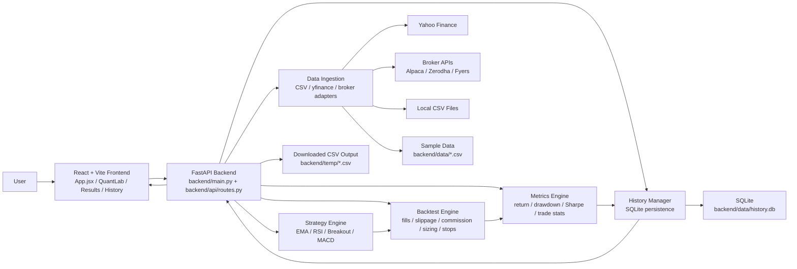

# QuantForge Block Diagram

## Notes

- `POST /api/backtest` drives the main research flow.
- `POST /api/download-data` drives CSV export flow.
- Active task progress is kept in the backend process; completed results are stored in SQLite.
- `intrabar` execution is an OHLC-based approximation, not a tick replay engine.
